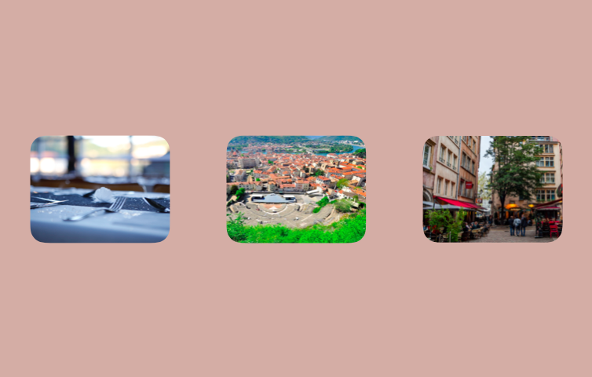
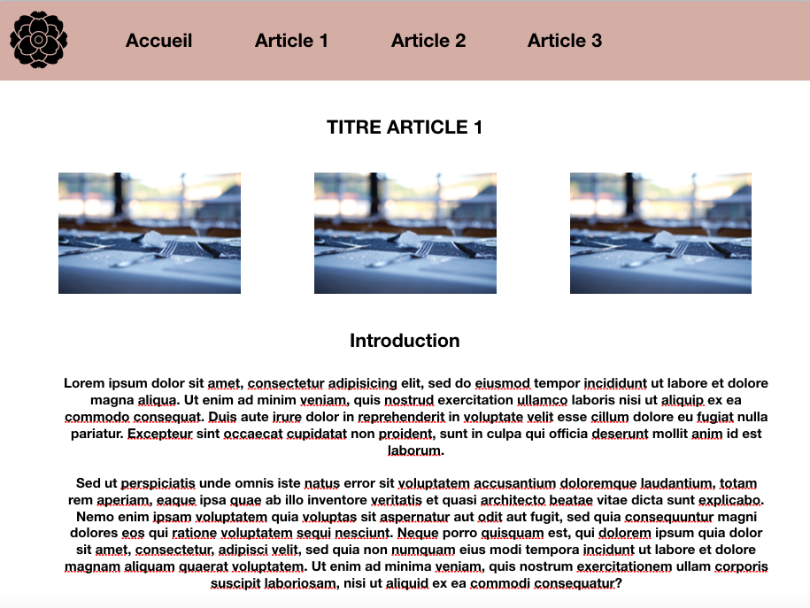
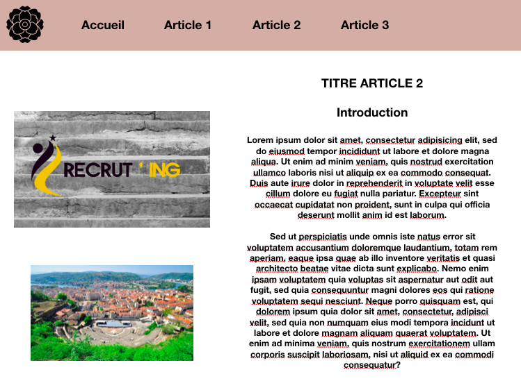
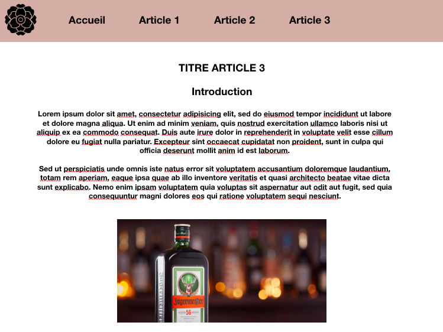

# Manon ZARTARIAN

## Site Portfolio

### Description
> Ce site est un site Porfolio, contenant mes différentes expériences depuis l'obtention de mon BAC jusq'à aujourd'hui. Ce site est un CV en ligne, vitrine des mes expériences et compétence.

### Cible
>  À destination des recruteurs Lyonnais et Viennois dans le domaine de la Communication et du Marketing, afin de poursuivre mes études dans ces domaines pour le rythme de l'alternance. Ce site va permettre aux recruteurs de mieux me connaitre à travers mes diverses expériences mais aussi de constater mes compétences en programmation de site web.

## Construction du site 

### Globale
* Page 1 : Page d'acceuil
* Page 2 : Article 1 : Expérience 1
* Page 3 : Article 2 : Expérience 2 
* Page 4 : Article 3 : Expérience 3

* Pas de header ni de sidebar sur la page d'accueil
* Header commun à toutes les pages d'articles
* La page d'accueil comporte une fonction Javascript


### Détaillée
```
 PAGE D'ACCUEIL 
```
 
 * Photo pour la mise en page 
 * Titre : Manon ZARTARIAN
 * Call to action : Boutons pour aller vers les articles
 
 > Image maquette page d'accueil
 
 
 
```
ARTICLE 1
```

* Photo du thème de l'article 
* Titre de l'article
* Introduction
* Article 
> Image maquette page Article
 

```
ARTICLE 2
```
* Photo du thème de l'article 
* Titre de l'article
* Introduction
* Article 
> Image maquette page Article


```
ARTICLE 3 
```
* Photo du thème de l'article 
* Titre de l'article
* Introduction
* Article 
> Image maquette page Article



